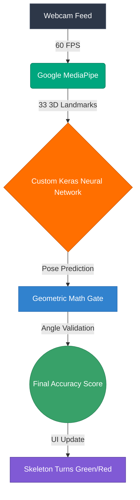

<div align="center">
  
# 🧘‍♂️ RehabBuddy - AI-Powered Yoga Instructor
  
**An intelligent, full-stack web application that uses Artificial Intelligence to analyze your yoga poses in real-time through your webcam.**

[](https://reactjs.org/)
[](https://www.tensorflow.org/js)
[](https://mediapipe.dev/)
[](https://flask.palletsprojects.com/)

</div>

---

## 🌟 Overview

InC acts as your personal digital yoga instructor. By turning on your webcam, the app instantly tracks your body movements and provides live, mathematical feedback on your posture. Whether you are practicing the Cobra Pose or balancing in the Tree Pose, InC calculates an accuracy score and challenges you to hold the perfect form.

It also features **Poco**, an AI-powered conversational chatbot built with the Google Gemini API, to help guide you through yoga philosophy and technical questions.

---

## 🧠 Machine Learning Architecture

Our AI pipeline uses a hybrid **"Eyes + Brain"** approach to achieve high-performance, real-time tracking in the browser:

1. **The Eyes (Google MediaPipe):** 
   Extracts 33 high-precision 3D landmarks (x, y, z coordinates) from your webcam feed at 60 FPS.
2. **The Brain (Custom TensorFlow Neural Network):**
   We discarded out-of-the-box models (like MoveNet) and trained our own **Keras Neural Network** on a custom dataset of ~1,600 images across 6 distinct poses. The model processes the 2D coordinates (x, y) to predict your current posture with ultra-low latency.
3. **The Geometric Gate:**
   To guarantee perfection, the raw AI prediction is passed through mathematical geometric gates (e.g., measuring the exact angle between your shoulder, hip, and knee) to ensure your form is physically correct before scoring.



---

## 🚀 Features

- **Live Pose Detection**: 100% client-side inference using WebGL/WASM. No webcam footage is ever sent to a server.
- **6 Supported Postures**: 
  - 🪑 Chair Pose
  - 🐍 Cobra Pose
  - 🐕 Downward Dog
  - 🧍‍♂️ Shoulder Stand
  - 🌳 Tree Pose
  - 🪵 Plank Pose
- **Real-Time Accuracy Scoring**: Receive live visual feedback. The skeleton turns **green** when your form is correct and **red** when you need to adjust.
- **Timer & High Scores**: The hold-timer only increments if your accuracy is above the threshold!
- **Poco AI Assistant**: A built-in Flask backend integrating the Google Gemini API for fitness and yoga chatting.
- **Cloud Database**: Integrated with Firebase to save user sessions and high scores.

---

## 🛠️ Tech Stack

### Frontend (Client)
- **Framework**: React.js
- **Styling**: Tailwind CSS & Chakra UI
- **Animations**: Framer Motion
- **Machine Learning**: `@tensorflow/tfjs`, `@mediapipe/pose`
- **Charts**: Chart.js / react-chartjs-2

### Backend (Server)
- **Framework**: Python / Flask
- **AI Integration**: Google Gemini API
- **Authentication/DB**: Firebase Realtime Database & Firebase Auth

---

## 📁 Repository Structure

```text
InC/
├── client/                                  # React Frontend
│   ├── src/
│   │   ├── components/                      # UI Components
│   │   ├── pages/                           # Application Routes
│   │   └── utils/                           # Geometric Math Logic
│   └── package.json
│
├── server/                                  # Python Backend (Poco Chatbot)
│   ├── controllers/
│   │   └── chat_controller.py               # Gemini API Integration
│   └── app.py                               # Flask Server
│
└── Machine_Learning_Models/                 # AI R&D and Model Training
    ├── 1_MoveNet_Attempt/                   # Initial failed MoveNet prototypes
    ├── 2_MediaPipe_RandomForest_Attempt/    # Python scikit-learn models
    └── 3_MediaPipe_NeuralNetwork_Final/     # Final TFJS Keras Model Notebooks
```

---

## 💻 Local Setup & Installation

### 1. Clone the Repository
```bash
git clone https://github.com/varadnb18/Techfiesta.git
cd InC
```

### 2. Frontend Setup
```bash
cd client
npm install

# IMPORTANT: You must provide your own API keys for Firebase & Gemini
# Create a .env file in the client/ folder:
# REACT_APP_GEMINI_API_KEY=your_key_here
# REACT_APP_FIREBASE_API_KEY=your_key_here
# ...

npm start
```
*The app will launch at `http://localhost:3000`.*

### 3. Backend Setup
```bash
cd server
python -m venv .venv

# Activate the virtual environment
# Windows:
.venv\Scripts\activate
# Mac/Linux:
source .venv/bin/activate

pip install -r requirements.txt
python app.py
```
*The backend API will run at `http://127.0.0.1:5000`.*

---

## 📝 License

This project is open-source and available under the MIT License.
